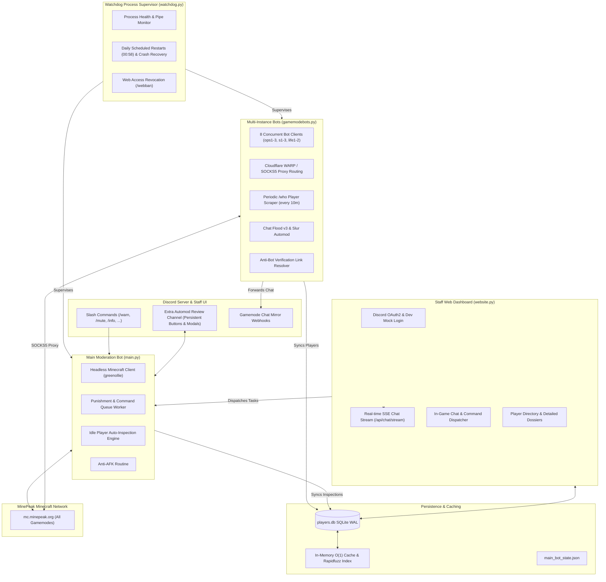

<div align="center">

  

  # MinePeak Automod & Staff Management Suite

  **An enterprise-grade, multi-process Minecraft automoderation, real-time network chat monitoring, player intelligence, and staff web administration ecosystem.**

  ---

  [](https://www.python.org/)
  [](https://discordpy.readthedocs.io/)
  [](https://github.com/PrismarineJS/mineflayer)
  [](https://fastapi.tiangolo.com/)
  [](https://sqlite.org/)
  [](https://pytest.org/)

</div>

---

## 📑 Table of Contents

- [Overview](#-overview)
- [System Architecture](#-system-architecture)
- [Core Features](#-core-features)
  - [1. Main Moderation Bot (`main.py`)](#1-main-moderation-bot-mainpy)
  - [2. Multi-Instance Gamemode Bots (`gamemodebots.py`)](#2-multi-instance-gamemode-bots-gamemodebotspy)
  - [3. Watchdog & Process Supervisor (`watchdog.py`)](#3-watchdog--process-supervisor-watchdogpy)
  - [4. Staff Web Dashboard (`website.py`)](#4-staff-web-dashboard-websitepy)
  - [5. SQLite Player Database & Rapidfuzz (`player_db.py`)](#5-sqlite-player-database--rapidfuzz-player_dbpy)
  - [6. Centralized Role-Based Permissions (`permissions.py`)](#6-centralized-role-based-permissions-permissionspy)
- [Discord Commands Reference](#-discord-commands-reference)
- [Configuration Guide](#-configuration-guide)
- [Installation & Setup](#-installation--setup)
- [Running the Services](#-running-the-services)
- [Testing](#-testing)
- [Repository Structure](#-repository-structure)

---

## 🌟 Overview

The **MinePeak Automod Suite** provides an end-to-end operational platform for managing Minecraft moderation, cross-server chat, and player analytics across the entire MinePeak network. Built with Python (asyncio, FastAPI, discord.py) and Node.js (Mineflayer), the system operates across multiple server sub-gamemodes (`ops1-3`, `s1-3`, `life1-2`), offering 24/7 crash recovery, live Server-Sent Events (SSE) web streaming, fuzzy search, and synchronized permission controls.

---

## 🏗 System Architecture



---

## ⚡ Core Features

### 1. Main Moderation Bot (`main.py`)
* **In-Game Command Execution:** Executes punishments directly in-game (`/warn`, `/mute`, `/ban`, `/kick`, etc.) across all sub-servers.
* **Intelligent Automod & Slur Enforcement:** Detects blacklisted terms and slurs in real time, applies 60-second player cooldowns, and executes punishments.
* **Automatic `/realname` De-Anonymization:** Resolves nicknamed players (`/realname <nick>`) before issuing punishments to ensure the underlying account is accurately sanctioned.
* **Extra Automod Review Queue:** Borderline violations, scam patterns (`mfa`, `free minecraft`, `free robux`), and flagged chat are posted to a staff review channel with **persistent action buttons** (`Warn`, `Mute`, `Ban`, `Ignore`) and pop-up modals that survive bot reboots.
* **Player Intelligence Engine:**
  * `/altcheck` & `/alts`: Compares IP logs, finds alternate accounts, and filters by cutoff dates.
  * `/iphist`: Queries player IP history and delivers sanitized, redacted output directly to the staff member's Discord DM.
  * `/info`, `/checkban`, `/checkmute`: Instantly checks ban and mute statuses with remaining durations and server scopes.
  * **Automated Idle Inspection:** In idle moments, automatically runs `/alts` and `/hist` on newly discovered players and records the parsed profiles into the database.
* **In-Game Staff Commands:** Permitted staff can control the bot directly inside Minecraft chat using `.runcmd <command>`.

---

### 2. Multi-Instance Gamemode Bots (`gamemodebots.py`)
* **Concurrent Multi-Server Presence:** Operates 8 simultaneous Minecraft bot clients across `ops1`, `ops2`, `ops3`, `s1`, `s2`, `s3`, `life1`, and `life2`.
* **SOCKS5 Proxy Tunneling:** Integrated Cloudflare WARP SOCKS5 proxy support (`127.0.0.1:4001`) with configurable proxy routing per instance to eliminate connection rate limits.
* **Staggered Login Sequences:** Configurable login delays (`bot_login_delay`) between instances to prevent server gateway throttles.
* **Automated Periodic Player Discovery (`/who`):** Executes `/who` on a periodic schedule (default: every 10 minutes), strips color codes, ranks, and clan brackets, and syncs newly discovered players to the central database.
* **Gamemode Chat Mirroring:** Mirrors live in-game chat to dedicated Discord channels via high-throughput webhooks.
* **Advanced Chat Flood Detection (`check_chat_flood_v3`):** Flags messages longer than 200 characters with $\ge 80\%$ uppercase letters or 2+ consecutive repeated word blocks.
* **Anti-Bot Verification Link Handler (`check_antibot_link`):** Detects `minepeak.org/antibot/` links in chat, executes an automated HTTP request with browser headers, and opens the link for immediate resolution.
* **Live Traffic Monitor (`/stats`):** Displays real-time Messages Per Second (MPS) per gamemode, updating live every 20 seconds using Discord Components v2 with automatic fallback to standard embeds.

---

### 3. Watchdog & Process Supervisor (`watchdog.py`)
* **Continuous Subprocess Monitoring:** Supervises both `main.py` and `gamemodebots.py` through non-blocking asynchronous pipes.
* **Automated Crash & Socket Recovery:** Detects process exits, uncaught exceptions, and socket disconnects, automatically triggering graceful restarts with cooldown timers.
* **Daily Scheduled Maintenance:** Automates scheduled network reboots at `00:58` server time (UTC-1) with a 10-minute pause window.
* **Discord Control Interface:** Manage services using `/start`, `/stop`, and `/restart` for `all`, `main_bot`, or `gamemode_bot`.
* **Staff Web Access Governance:** Use `/webban`, `/webunban`, and `/listwebban` (or text command equivalents `!webban`, `!webunban`, `!listwebban`) to revoke or restore staff access to the web dashboard.

---

### 4. Staff Web Dashboard (`website.py`)
* **Modern Web Interface:** Built with FastAPI, Jinja2, vanilla ES6 JavaScript, and responsive CSS with full Dark and Light theme toggle support.
* **Discord OAuth2 & Developer Mock Authentication:** Secure role validation through Discord OAuth2 with local mock authentication support for rapid development.
* **Session Security:** Dynamically randomized restart salts (`invalidate_sessions_on_restart`) force session invalidation upon server restarts.
* **Real-time Server-Sent Events (SSE) Chat Stream:** Streams in-game chat across all sub-servers with zero WebSocket overhead via `/api/chat/stream`.
* **Live In-Game Messenger & Command Dispatcher:** Permitted staff can send messages or issue administrative commands into any sub-server directly from the browser.
* **Fuzzy Player Search & Dossiers:**
  * Sub-millisecond player search powered by Rapidfuzz.
  * Displays player rank, clan, tag, last-seen server, last-seen timestamp, total message count, linked alts, and full punishment history.
  * **On-Demand Live Inspection:** Staff can trigger an on-demand `/alts` and `/hist` inspection directly from the player card.
  * **Web Moderation Actions:** Execute Warn, Mute, Ban, Kick, Unwarn, Unmute, or Unban directly from the web browser.
* **System & Bot Health Metrics:** Live CPU, memory, uptime, PID, and active task monitors.

---

### 5. SQLite Player Database & Rapidfuzz (`player_db.py`)
* **Persistent High-Performance Storage:** SQLite database (`players.db`) configured with Write-Ahead Logging (WAL) and normal synchronization for concurrent multi-process access.
* **Schema Breakdown:**
  * `players`: Tracks username, addition timestamp, rank, clan, chat tag, last-seen server, last-seen timestamp, and total message counts.
  * `player_inspections`: Caches parsed alts list, punishment history entries, raw outputs, and inspection statuses.
* **In-Memory O(1) Cache:** Memory cache eliminates repetitive disk reads and powers instant Discord slash command autocompletion.
* **Historical Chat Backfill:** Automatically scans past logs (`gamemodebot.log`) on startup to backfill player ranks, clans, and chat tags.
* **Legacy Data Migration:** Imports legacy player records from `temp.yml` seamlessly on startup.

---

### 6. Centralized Role-Based Permissions (`permissions.py`)
* **Unified RBAC Model:** A centralized permission authority configured in `permissions.yml` enforced across Discord slash commands, Watchdog controls, and Web Dashboard features.
* **Role Hierarchy:**
  $$\text{Manager} > \text{Senior Moderator} > \text{Moderator} > \text{Junior Moderator}$$
* **Administrative Overrides:** Dedicated Discord User IDs (e.g. `1160185988065271810`) bypass all role checks with full administrative access.
* **Granular Privilege Mapping:** Junior Moderators can chat and issue basic punishments but cannot run raw server console commands.

---

## 🤖 Discord Commands Reference

### Main Bot Commands (`main.py`)

| Command | Description | Minimum Role |
| :--- | :--- | :--- |
| `/warn` | Warn a player with a specified reason | Junior Moderator |
| `/mute` | Mute a player with duration, reason, and server target | Junior Moderator |
| `/ipmute` | IP-mute a player across the network | Moderator |
| `/ban` | Ban a player with optional duration and reason | Junior Moderator |
| `/ipban` | IP-ban a player network-wide | Moderator |
| `/kick` | Kick a player from the server | Junior Moderator |
| `/unban` | Unban a previously banned player | Junior Moderator |
| `/unmute` | Unmute a muted player | Junior Moderator |
| `/unwarn` | Remove a warning from a player | Junior Moderator |
| `/info` | Comprehensive player dossier (ban status, mute status, alts, history) | Junior Moderator |
| `/checkban` | Check active ban details for a player | Junior Moderator |
| `/checkmute` | Check active mute details for a player | Junior Moderator |
| `/hist` | Look up a player's complete punishment history | Junior Moderator |
| `/alts` | Look up known alternate accounts linked to a player | Junior Moderator |
| `/altcheck` | Advanced alt-account cross-verification with optional date cutoff | Junior Moderator |
| `/iphist` | View a player's IP history (delivered securely via DM) | Moderator |
| `/gamemode` | Switch the main bot to a specified gamemode sub-server | Junior Moderator |
| `/broadcast` | Send a server-wide broadcast announcement | Junior Moderator |
| `/chat` | Send a chat message through the bot | Junior Moderator |
| `/runcmd` | Execute an arbitrary command in Minecraft | Moderator |
| `/acunban` | Unban a player from anti-cheat flags | Junior Moderator |
| `/status` | View main bot status, current activity, and uptime | Junior Moderator |
| `/login` | Manually trigger bot authentication | Junior Moderator |
| `/help` | List available commands and role permissions | Junior Moderator |

### Gamemode Bot Commands (`gamemodebots.py`)

| Command | Description | Minimum Role |
| :--- | :--- | :--- |
| `/stats` | Live Messages Per Second (MPS) dashboard across all gamemodes | Junior Moderator |
| `/rungmcmd` | Execute a command or send chat through a specific gamemode bot | Moderator |
| `/togglebot` | Enable or disable a specific gamemode bot instance dynamically | Manager |

### Watchdog Bot Commands (`watchdog.py`)

| Command | Description | Minimum Role |
| :--- | :--- | :--- |
| `/restart [bot]` | Restart `all`, `main_bot`, or `gamemode_bot` | Manager |
| `/start [bot]` | Start a stopped bot process | Manager |
| `/stop [bot]` | Stop a running bot process | Manager |
| `/webban` / `!webban` | Revoke a staff member's web portal access | Manager |
| `/webunban` / `!webunban` | Restore web portal access for a staff member | Manager |
| `/listwebban` / `!listwebban` | List all staff members banned from the web portal | Manager |

---

## ⚙️ Configuration Guide

Each component is configured independently via dedicated YAML configuration files:

* [`main.yml`](main.yml): Minecraft credentials (`host`, `port`, `username`, `password`), Discord bot token, channel IDs (`reply_channel`, `punishment_channel`, `extra_automod_channel`), staff members list, and automod trigger keywords.
* [`gamemodebots.yml`](gamemodebots.yml): Gamemode bot instances list (sub-server name, bot account username/password, webhook URL, proxy toggle), WARP SOCKS5 proxy settings, login delays, and `/who` scrape interval.
* [`watchdog.yml`](watchdog.yml): Watchdog bot token, script paths, scheduled daily stop time (`00:58`), pause duration, and crash notification webhooks.
* [`website.yml`](website.yml): Web server host/port, session secrets, Discord OAuth2 credentials (`client_id`, `client_secret`, `redirect_uri`), theme colors, and developer mock users.
* [`permissions.yml`](permissions.yml): Discord role IDs (`manager`, `srmod`, `mod`, `jrmod`), administrator user ID overrides, and command-to-role mappings.

---

## 🚀 Installation & Setup

### Prerequisites
* **Python:** 3.10 or higher
* **Node.js:** v18.0.0 or higher
* **SOCKS5 Proxy (Optional):** Cloudflare WARP or local SOCKS5 proxy on `127.0.0.1:4001`
* **Git**

### 1. Clone the Repository
```bash
git clone https://github.com/greenollie/minepeak_automod_bot.git
cd minepeak_automod_bot
```

### 2. Create and Activate Virtual Environment
```bash
# Windows
python -m venv venv
venv\Scripts\activate

# Linux / macOS
python3 -m venv venv
source venv/bin/activate
```

### 3. Install Python Dependencies
```bash
pip install -r requirements.txt
```

### 4. Install Node.js Mineflayer Dependency
```bash
npm install mineflayer@github:GenerelSchwerz/mineflayer socks
```

### 5. Configure Settings
Copy and adjust the credentials in each YAML file:
* Set your bot tokens and channel IDs in `main.yml`, `gamemodebots.yml`, `watchdog.yml`, and `website.yml`.
* Update Discord Role IDs in `permissions.yml`.

---

## 🎮 Running the Services

### Option A: Running with Watchdog Supervisor (Recommended for Production)
The Watchdog supervisor automatically launches, monitors, and restarts both the Main Bot and Gamemode Bots:
```bash
python watchdog.py
```

### Option B: Running the Staff Web Dashboard
```bash
python website.py
```
* Access the web dashboard at `http://localhost:8000`.
* For local development without Discord OAuth credentials, visit:
  `http://localhost:8000/auth/dev-login?user=greenollie`

### Option C: Running Standalone Bots
To run bots independently for debugging:
```bash
# Main Bot
python main.py

# Gamemode Bots
python gamemodebots.py
```

---

## 🧪 Testing

The test suite validates role permissions, web authentication, SSE streams, fuzzy matching, and command security:
```bash
pytest test_permissions.py test_web.py -v
```

---

## 📁 Repository Structure

```
.
├── conftest.py             # Pytest test session fixtures & mock discord setup
├── gamemodebots.py         # Multi-instance gamemode monitoring & automod bots
├── gamemodebots.yml        # Gamemode bots configuration & instance definitions
├── main.py                 # Primary moderation bot, punishment executor & Discord interface
├── main.yml                # Main bot credentials, Discord channels & automod words
├── permissions.py          # Centralized RBAC permission engine
├── permissions.yml         # Role IDs, overrides, and granular command mappings
├── player_db.py            # SQLite database manager & Rapidfuzz fuzzy autocomplete
├── requirements.txt        # Python package dependencies
├── test_permissions.py     # Unit tests for role-based permissions
├── test_web.py             # Integration tests for web dashboard, auth & API endpoints
├── watchdog.py             # Process supervisor, crash recovery & restart scheduler
├── watchdog.yml            # Watchdog configuration & webhook alerts
├── web_sessions.py         # Web user kick & session revocation manager
├── website.py              # FastAPI web dashboard backend & SSE chat streaming
├── website.yml             # Web server settings, OAuth2 credentials & theme config
├── Minepeak_staff_logo.png # Official MinePeak staff brand logo
├── static/                 # Frontend assets
│   ├── css/style.css       # Glassmorphism dark/light stylesheet
│   └── js/app.js           # Frontend reactive controller & SSE receiver
└── templates/              # Jinja2 HTML templates
    ├── dashboard.html      # Comprehensive staff control dashboard
    └── login.html          # Discord OAuth2 login portal
```

---

<div align="center">
  <sub>Developed with ❤️ for the <strong>MinePeak Network</strong> staff team.</sub>
</div>
