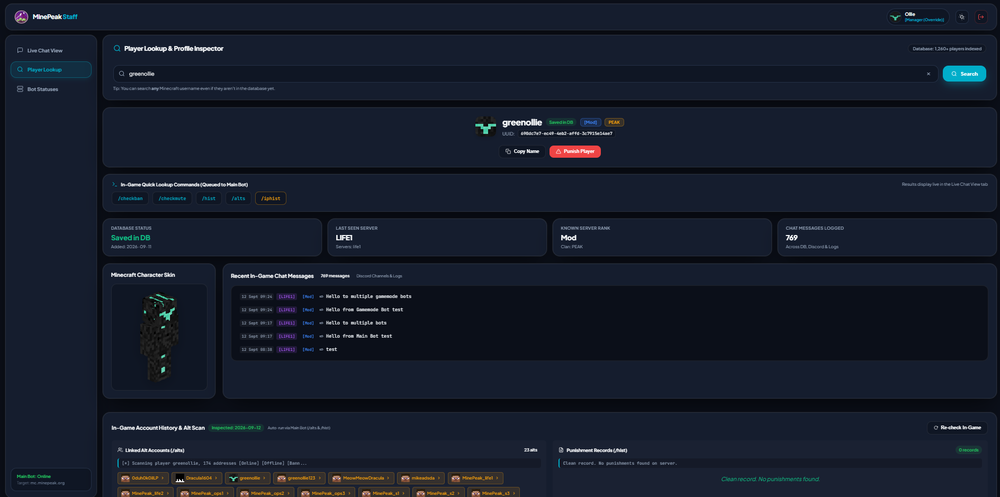
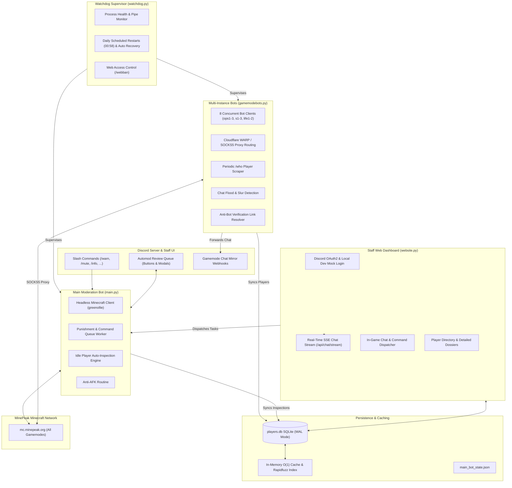

<div align="center">

# MinePeak Staff Bot and Moderation Suite

A coordinated system for multi-server Minecraft moderation, cross-gamemode chat monitoring, player intelligence, and staff web administration.

[](https://www.python.org/)
[](https://discordpy.readthedocs.io/)
[](https://github.com/PrismarineJS/mineflayer)
[](https://fastapi.tiangolo.com/)
[](https://sqlite.org/)
[](https://pytest.org/)

</div>

---

## Interface Preview

| Staff Web Dashboard and Player Dossier | Discord OAuth2 Login Portal |
| :---: | :---: |
|  |  |

---

## Table of Contents

- [Overview](#overview)
- [System Architecture](#system-architecture)
- [Core Features](#core-features)
  - [1. Main Moderation Bot (`main.py`)](#1-main-moderation-bot-mainpy)
  - [2. Multi-Instance Gamemode Bots (`gamemodebots.py`)](#2-multi-instance-gamemode-bots-gamemodebotspy)
  - [3. Watchdog Process Supervisor (`watchdog.py`)](#3-watchdog-process-supervisor-watchdogpy)
  - [4. Staff Web Dashboard (`website.py`)](#4-staff-web-dashboard-websitepy)
  - [5. SQLite Player Database and Rapidfuzz (`player_db.py`)](#5-sqlite-player-database-and-rapidfuzz-player_dbpy)
  - [6. Centralized Role Permissions (`permissions.py`)](#6-centralized-role-permissions-permissionspy)
- [Discord Commands Reference](#discord-commands-reference)
- [Configuration Guide](#configuration-guide)
- [Installation and Setup](#installation-and-setup)
- [Running the Services](#running-the-services)
- [Testing](#testing)
- [Repository Structure](#repository-structure)

---

## Overview

Managing moderation across a multi-gamemode Minecraft network gets messy fast. Players hop between servers, change nicknames, switch to alternate accounts, and test chat filters across different lobbies. Moderating each server manually requires staff to be everywhere at once, which quickly falls apart at scale.

The MinePeak Staff Suite brings all moderation activity into one synchronized hub. It pairs headless Minecraft bot accounts across every sub-server (`ops1-3`, `s1-3`, `life1-2`) with a central Discord moderation bot, an asynchronous background watchdog, and a web dashboard built with FastAPI.

Instead of logging into eight separate Minecraft servers, staff can monitor network chat in real time, review flagged messages in Discord, inspect linked alts and punishment histories, and issue punishments directly from Discord or a browser.

---

## System Architecture



---

## Core Features

### 1. Main Moderation Bot (`main.py`)

- **In-Game Command Execution:** Dispatches moderation punishments (`/warn`, `/mute`, `/ban`, `/kick`, etc.) directly into Minecraft across any connected sub-server.
- **Slur and Word Blacklist Detection:** Catches blacklisted terms in real time, places offending players on a 60-second cooldown, and applies the configured server punishments.
- **Nickname Resolution:** Runs `/realname <nick>` before issuing a punishment so sanctions target the actual account even if the player changed their display nickname.
- **Extra Automod Review Queue:** Suspicious messages (such as phishing links, MFA scams, or fake free item spam) get sent to a private staff channel on Discord. Staff can click persistent action buttons (`Warn`, `Mute`, `Ban`, `Ignore`) or open interactive modals to adjust details. These buttons stay active across bot restarts.
- **Player Investigation Tools:**
  - `/altcheck` and `/alts` inspect IP logs to identify alternate accounts, with optional date cutoff filtering.
  - `/iphist` pulls player IP records and sends the sanitized, redacted output directly to staff DMs.
  - `/info`, `/checkban`, and `/checkmute` display active ban and mute statuses, remaining durations, and server scopes.
  - **Idle Player Scanner:** During quiet periods when the bot is idle, it automatically runs `/alts` and `/hist` on newly discovered players and stores the parsed profiles in the database.
- **In-Game Staff Commands:** Permitted staff can control the bot directly inside Minecraft chat using `.runcmd <command>`.

---

### 2. Multi-Instance Gamemode Bots (`gamemodebots.py`)

- **Multi-Server Presence:** Operates 8 headless bot clients concurrently across `ops1`, `ops2`, `ops3`, `s1`, `s2`, `s3`, `life1`, and `life2`.
- **SOCKS5 Proxy Tunneling:** Integrates Cloudflare WARP SOCKS5 proxy routing (`127.0.0.1:4001`) with configurable proxy toggles per bot instance to avoid IP rate limits and gateway blocks.
- **Staggered Login Delays:** Configurable login delays (`bot_login_delay`) between instance connections prevent server firewalls from flagging bot connections as a login surge.
- **Periodic Player Discovery (`/who`):** Periodically runs `/who` (default: every 10 minutes), strips color codes, clan prefixes, and brackets, and records newly discovered players into the database.
- **Discord Chat Mirroring:** Forwards in-game chat to dedicated Discord channels using high-throughput webhooks.
- **Chat Flood Detection:** Identifies messages longer than 200 characters with 80% or more uppercase letters or repeated word blocks.
- **Anti-Bot Verification Handler:** Detects verification links (`minepeak.org/antibot/`) in chat, sends an automated HTTP request with browser headers, and opens the link to clear challenges.
- **Live Traffic Monitor (`/stats`):** Displays real-time Messages Per Second (MPS) per gamemode, updating live every 20 seconds using Discord Components v2 with automatic fallback to standard embeds.

---

### 3. Watchdog Process Supervisor (`watchdog.py`)

- **Subprocess Supervision:** Monitors both `main.py` and `gamemodebots.py` through non-blocking asynchronous pipes.
- **Automated Crash Recovery:** Detects process exits, uncaught exceptions, and socket drops, automatically triggering restarts with cooldown timers to prevent restart loops.
- **Scheduled Daily Maintenance:** Automates scheduled network reboots at `00:58` server time (UTC-1) with a 10-minute pause window so bots pause reconnects during server maintenance.
- **Discord Bot Controls:** Manage running services using `/start`, `/stop`, and `/restart` for `all`, `main_bot`, or `gamemode_bot`.
- **Web Portal Access Control:** Managers can use `/webban`, `/webunban`, and `/listwebban` (or text commands `!webban`, `!webunban`, `!listwebban`) to revoke or restore staff access to the web dashboard.

---

### 4. Staff Web Dashboard (`website.py`)

- **Fast and Responsive UI:** Built with FastAPI, Jinja2, vanilla ES6 JavaScript, and responsive CSS with dark and light theme toggle support.
- **Discord OAuth2 and Local Dev Login:** Secure role validation through Discord OAuth2, with an optional mock login for local offline testing.
- **Session Security:** Dynamic restart salts (`invalidate_sessions_on_restart`) force session invalidation whenever the web server restarts.
- **Real-Time SSE Chat Stream:** Streams live in-game chat across all sub-servers with zero WebSocket overhead via `/api/chat/stream`.
- **In-Browser Messenger and Command Runner:** Staff can send messages or run administrative commands on any sub-server directly from their browser.
- **Fuzzy Player Search and Dossiers:**
  - Sub-millisecond player search powered by Rapidfuzz.
  - Displays rank, clan, chat tags, last-seen server, last-seen timestamp, total message count, linked alts, and full punishment history.
  - Lets staff run on-demand `/alts` and `/hist` scans on any player in real time.
  - Staff can execute Warn, Mute, Ban, Kick, Unwarn, Unmute, or Unban actions directly from the browser.
- **System Health Metrics:** Live CPU, memory, uptime, process PID, and active task counters.

---

### 5. SQLite Player Database and Rapidfuzz (`player_db.py`)

- **Reliable Local Storage:** SQLite database (`players.db`) configured with Write-Ahead Logging (WAL) and normal synchronization for smooth concurrent multi-process access.
- **Schema Breakdown:**
  - `players`: Tracks username, first-seen timestamp, rank, clan, chat tag, last-seen server, last-seen timestamp, and total message counts.
  - `player_inspections`: Caches parsed alts lists, punishment history records, raw command outputs, and scan statuses.
- **In-Memory Cache:** Keeps frequently accessed player records in memory for instant Discord slash command autocompletion.
- **Historical Chat Backfill:** Scans `gamemodebot.log` on startup to backfill player ranks, clans, and chat tags.
- **Legacy Migration:** Automatically imports existing player records from `temp.yml` on startup.

---

### 6. Centralized Role Permissions (`permissions.py`)

- **Single Permission Authority:** All permission checks are defined in `permissions.yml` and shared across Discord slash commands, Watchdog controls, and Web Dashboard features.
- **Role Hierarchy:**
  Manager > Senior Moderator > Moderator > Junior Moderator
- **Admin Overrides:** Specific Discord User IDs bypass role checks for complete administrative access.
- **Sensible Boundaries:** Junior Moderators can chat and issue standard punishments, but cannot execute raw Minecraft console commands.

---

## Discord Commands Reference

### Main Bot Commands (`main.py`)

| Command | Description | Minimum Role |
| :--- | :--- | :--- |
| `/warn` | Warn a player with a specified reason | Junior Moderator |
| `/mute` | Mute a player with duration, reason, and server target | Junior Moderator |
| `/ipmute` | IP-mute a player across the network | Moderator |
| `/ban` | Ban a player with duration and reason | Junior Moderator |
| `/ipban` | IP-ban a player network-wide | Moderator |
| `/kick` | Kick a player from the server | Junior Moderator |
| `/unban` | Unban a previously banned player | Junior Moderator |
| `/unmute` | Unmute a muted player | Junior Moderator |
| `/unwarn` | Remove a warning from a player | Junior Moderator |
| `/info` | Comprehensive player dossier (ban status, mute status, alts, history) | Junior Moderator |
| `/checkban` | Check active ban details for a player | Junior Moderator |
| `/checkmute` | Check active mute details for a player | Junior Moderator |
| `/hist` | Look up a player's complete punishment history | Junior Moderator |
| `/alts` | Look up known alternate accounts linked to a player | Junior Moderator |
| `/altcheck` | Alt-account cross-verification with optional date cutoff | Junior Moderator |
| `/iphist` | View a player's IP history (delivered securely via DM) | Moderator |
| `/gamemode` | Switch the main bot to a specified gamemode sub-server | Junior Moderator |
| `/broadcast` | Send a server-wide broadcast announcement | Junior Moderator |
| `/chat` | Send a chat message through the bot | Junior Moderator |
| `/runcmd` | Execute an arbitrary command in Minecraft | Moderator |
| `/acunban` | Unban a player from anti-cheat flags | Junior Moderator |
| `/status` | View main bot status, current activity, and uptime | Junior Moderator |
| `/login` | Manually trigger bot authentication | Junior Moderator |
| `/help` | List available commands and role permissions | Junior Moderator |

### Gamemode Bot Commands (`gamemodebots.py`)

| Command | Description | Minimum Role |
| :--- | :--- | :--- |
| `/stats` | Live Messages Per Second (MPS) dashboard across all gamemodes | Junior Moderator |
| `/rungmcmd` | Execute a command or send chat through a specific gamemode bot | Moderator |
| `/togglebot` | Enable or disable a specific gamemode bot instance dynamically | Manager |

### Watchdog Bot Commands (`watchdog.py`)

| Command | Description | Minimum Role |
| :--- | :--- | :--- |
| `/restart [bot]` | Restart `all`, `main_bot`, or `gamemode_bot` | Manager |
| `/start [bot]` | Start a stopped bot process | Manager |
| `/stop [bot]` | Stop a running bot process | Manager |
| `/webban` / `!webban` | Revoke a staff member's web portal access | Manager |
| `/webunban` / `!webunban` | Restore web portal access for a staff member | Manager |
| `/listwebban` / `!listwebban` | List all staff members banned from the web portal | Manager |

---

## Configuration Guide

Each component is configured independently through dedicated YAML configuration files:

- [`main.yml`](main.yml): Minecraft credentials (`host`, `port`, `username`, `password`), Discord bot token, channel IDs (`reply_channel`, `punishment_channel`, `extra_automod_channel`), staff members list, and automod trigger keywords.
- [`gamemodebots.yml`](gamemodebots.yml): Gamemode bot instances list (sub-server name, bot account username/password, webhook URL, proxy toggle), WARP SOCKS5 proxy settings, login delays, and `/who` scrape interval.
- [`watchdog.yml`](watchdog.yml): Watchdog bot token, script paths, scheduled daily stop time (`00:58`), pause duration, and crash notification webhooks.
- [`website.yml`](website.yml): Web server host/port, session secrets, Discord OAuth2 credentials (`client_id`, `client_secret`, `redirect_uri`), theme colors, and developer mock users.
- [`permissions.yml`](permissions.yml): Discord role IDs (`manager`, `srmod`, `mod`, `jrmod`), administrator user ID overrides, and command-to-role mappings.

---

## Repository Structure

```
.
├── conftest.py             # Pytest test session fixtures & mock discord setup
├── gamemodebots.py         # Multi-instance gamemode monitoring & automod bots
├── gamemodebots.yml        # Gamemode bots configuration & instance definitions
├── main.py                 # Primary moderation bot, punishment executor & Discord interface
├── main.yml                # Main bot credentials, Discord channels & automod words
├── permissions.py          # Centralized RBAC permission engine
├── permissions.yml         # Role IDs, overrides, and granular command mappings
├── player_db.py            # SQLite database manager & Rapidfuzz fuzzy autocomplete
├── requirements.txt        # Python package dependencies
├── test_permissions.py     # Unit tests for role-based permissions
├── test_web.py             # Integration tests for web dashboard, auth & API endpoints
├── watchdog.py             # Process supervisor, crash recovery & restart scheduler
├── watchdog.yml            # Watchdog configuration & webhook alerts
├── web_sessions.py         # Web user kick & session revocation manager
├── website.py              # FastAPI web dashboard backend & SSE chat streaming
├── website.yml             # Web server settings, OAuth2 credentials & theme config
├── login_screen.png        # Discord OAuth2 login portal preview
├── player_searcher.png     # Staff dashboard & player dossier preview
├── static/                 # Frontend assets
│   ├── css/style.css       # Glassmorphism dark/light stylesheet
│   └── js/app.js           # Frontend reactive controller & SSE receiver
└── templates/              # Jinja2 HTML templates
    ├── dashboard.html      # Comprehensive staff control dashboard
    └── login.html          # Discord OAuth2 login portal
```

---

<div align="center">
  <sub>Built by green.ollie for the MinePeak staff team</sub>
</div>
