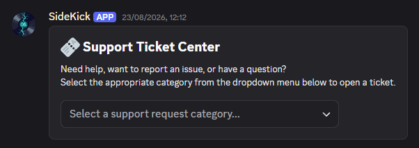
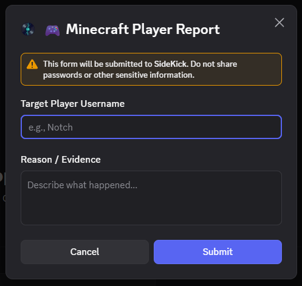
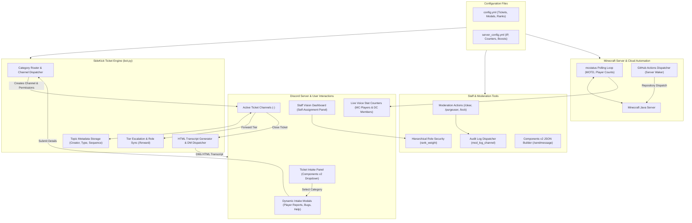

<div align="center">

# SideKick Ticket Bot and Server Manager

A unified Discord management bot featuring tiered support tickets, dynamic modal forms, HTML transcripts, and live Minecraft server integration.

[](https://www.python.org/)
[](https://discordpy.readthedocs.io/)
[](https://mcstatus.io/)
[](https://github.com/features/actions)
[](https://discord.com/)
[](https://discordpy.readthedocs.io/)

</div>

---

## Interface Preview

| Support Ticket Dropdown Panel | Custom Intake Modal Form |
| :---: | :---: |
|  |  |

---

## Table of Contents

- [Overview](#overview)
- [System Architecture](#system-architecture)
- [Core Features](#core-features)
  - [1. Support Ticket System](#1-support-ticket-system)
  - [2. Staff Hierarchy and Vision Dashboard](#2-staff-hierarchy-and-vision-dashboard)
  - [3. Minecraft Server Integration and Monitoring](#3-minecraft-server-integration-and-monitoring)
  - [4. Server Boost System](#4-server-boost-system)
  - [5. Moderation and Channel Controls](#5-moderation-and-channel-controls)
  - [6. Components v2 Message Builder](#6-components-v2-message-builder)
- [Discord Commands Reference](#discord-commands-reference)
- [Configuration Guide](#configuration-guide)
- [Installation and Setup](#installation-and-setup)
- [Running the Bot](#running-the-bot)
- [Repository Structure](#repository-structure)

---

## Overview

Managing player support across an active Discord and Minecraft community can quickly get chaotic. When tickets arrive through unstructured DMs or a generic help channel, requests slip through the cracks, staff lose time asking for missing info, and handoffs between helpers, moderators, and developers end in confusion.

SideKick organizes the entire support lifecycle from intake to archiving. Players open tickets through interactive dropdown menus and dynamic modal forms, ensuring crucial context (such as in-game usernames and evidence) is collected upfront.

Tickets route into dedicated category channels, support quick role escalation across staff tiers, and compile into standalone HTML transcripts when resolved. Alongside ticketing, the bot monitors Minecraft server health, updates live voice channel player counts, wakes sleeping servers via GitHub Actions, and handles server boost celebrations.

---

## System Architecture



---

## Core Features

### 1. Support Ticket System

- **Interactive Intake Panel:** Built with Discord Message Layout Components v2 with rounded containers and dropdown menus. If Components v2 is not available, it automatically falls back to standard embeds. Dropdowns persist across bot restarts via persistent views registered in `setup_hook`.
- **Dynamic Intake Modal Forms:** Ticket categories can launch Discord Modals requesting specific user details (such as Target Player Username, Evidence, or Bug Details). Supports single-line and multi-line paragraph fields, custom placeholders, character limits, and required vs. optional fields. Categories without modals open tickets immediately upon selection.
- **Channel Routing & Organization:** Each ticket category automatically creates channels within its own dedicated Discord category folder. Channels follow the naming convention `<rolegroup>-<username>` (e.g. `helper-notch`). Concurrent tickets from the same user append sequential numbers (`helper-notch-2`). A configurable `max_open_tickets` setting stops ticket spam.
- **Channel Topic Metadata:** Critical ticket metadata (Creator ID, Ticket Type, Category Key, Rolegroup, Sequence Number) is encoded directly into the Discord channel topic. This eliminates external database requirements and allows the bot to recover active tickets seamlessly after any restart.
- **Member Access & Escalation:**
  - `/addmember` and `/removemember` grant or revoke participant access to an active ticket.
  - `/forward` passes tickets across staff tiers (such as `helper` to `mod` to `dev` to `manager` to `owner`). It updates channel permissions to grant access to the new tier while removing the previous tier, renames the channel prefix, provides autocomplete for valid targets, and posts an explanatory embed in the channel.
- **Closure & HTML Transcripts:**
  - `/closerequest` prompts the ticket creator with interactive confirmation buttons (Close Ticket or Keep Open).
  - `/close` allows authorized staff or Master Roles to close and delete a ticket immediately.
  - Generates a styled, standalone HTML transcript (`transcript-<channel>.html`) containing the full conversation history, user badges (`Creator`, `Staff`, `Bot`), formatted timestamps, hyperlinked attachment previews, and initial modal submissions.
  - Automatically saves the transcript file to the central archive channel (`transcript_channel_id`) and sends a copy directly to the ticket creator via Discord DM.
  - Displays a 5-second countdown warning before deleting the Discord channel to avoid abrupt closures.

---

### 2. Staff Hierarchy and Vision Dashboard

- **Vision Self-Assignment Panel (`/setup_staff_roles`):** Deploys a persistent button dashboard where staff members can toggle channel visibility for lower support tiers on or off. This keeps channel lists organized so staff can focus on their active queues.
- **Hierarchical Role Security:** Role ranks use numerical weights (`rank_weight`). Staff can only toggle visibility for tiers ranked strictly below their own highest verified role. Master roles bypass tier restrictions and can toggle any staff tier.
- **Discord Role Hierarchy Handling:** Catches permission issues gracefully and alerts administrators if the bot's role needs to be moved higher in Discord Server Settings.

---

### 3. Minecraft Server Integration and Monitoring

- **Live Server Monitoring:** Periodically queries the Minecraft Java server via `mcstatus` for online status, player counts, max capacity, and MOTD. Automatically strips Minecraft legacy color codes (`§a`, `§l`) and hex formats (`§x...`) for clean Discord embeds.
- **Dynamic Presence:** Automatically sets the bot status to `Playing <server_ip>` when the server is online.
- **Voice Channel Stat Counters:** Updates dedicated voice channel names with live player counts (`MC Players: 15/100`) and Discord member counts (`DC Members: 1,450`). Renames are throttled to respect Discord's rate limit of 2 renames per 10 minutes. Stat voice channels automatically deny `@everyone` connect permissions to stay display-only.
- **Cloud Server Waker (`/start`):** Integrates with GitHub Actions via the GitHub REST API repository dispatch (`wake-server`). Sends a wake signal using a personal access token (PAT) to spin up headless runners that start dormant Minecraft servers on demand.
- **On-Demand Status Command (`/mcstatus`):** Lets players and staff check live Minecraft server status and Discord member counts at any time.

---

### 4. Server Boost System

- **Dual-Event Boost Detection:** Catches new server boosters through guild member update events (`premium_since`) and native Discord system messages across all boost tiers.
- **Anti-Spam Cooldown:** A 60-second debounce window per member prevents duplicate announcement messages.
- **Modern Components v2 Announcements:** Displays rich announcement containers with the booster's avatar, custom server perks from `server_config.yml`, ticket claim instructions, and current guild boost counts. Automatically falls back to standard embeds if Components v2 is disabled.
- **Boost Preview Command (`/testboostmessage`):** Allows administrators to preview and verify boost announcement layouts in any channel for any member.

---

### 5. Moderation and Channel Controls

- **Chat Purge Tools:** `/clear [amount]` bulk deletes between 1 and 100 recent messages, and `/purgeuser [member] [amount]` scans recent messages and removes only messages sent by a specific user.
- **Channel Locking Controls:** `/lock [reason]` revokes `@everyone` send permissions, and `/unlock` restores them.
- **Centralized Audit Logging:** Logs all moderation actions (clears, user purges, channel locks, and unlocks) to a designated audit channel (`mod_log_channel_id`) with target, moderator, reason, and timestamp details.

---

### 6. Components v2 Message Builder

- **Custom Announcement Builder:** `/sendmessage` and `!makemessage` compile and send interactive messages using Discord Message Layout Components v2 (Flags: `32768`).
- **Multi-Part Message Assembly:** Accepts split JSON across consecutive messages (`parts` parameter) to work around Discord's 2,000-character message limit.
- **Flexible Input Sources:** Parses JSON from message replies, markdown code blocks, attached `.json` or `.txt` files, or recent channel history from the author.
- **Automatic Cleansing:** Deletes the source command and raw JSON inputs to keep announcement channels clean.
- **Role-Gated Security:** Restricted to users holding the configured `makemessage_role_id` or Master Roles.

---

## Discord Commands Reference

| Command | Type | Permissions Required | Description |
| :--- | :--- | :--- | :--- |
| `/ticket` | Hybrid (Slash & Prefix) | Everyone | Manually opens a new general support ticket |
| `/addmember [member]` | Hybrid (Slash & Prefix) | Ticket Staff / Master | Adds a user to the current ticket channel |
| `/removemember [member]` | Hybrid (Slash & Prefix) | Ticket Staff / Master | Removes a user from the current ticket channel |
| `/forward [rolegroup] [reason]` | Hybrid (Slash & Prefix) | Ticket Staff / Master | Forwards ticket to another tier, updates roles, and renames channel |
| `/closerequest` | Hybrid (Slash & Prefix) | Ticket Staff / Master | Sends confirmation close buttons to the ticket creator |
| `/close` | Hybrid (Slash & Prefix) | Close Allowed Roles / Master | Closes ticket, generates HTML transcript, and deletes channel |
| `/setup_tickets` | Hybrid (Slash & Prefix) | Master Roles Only | Deploys the interactive ticket creation dropdown panel |
| `/setup_staff_roles` | Hybrid (Slash & Prefix) | Master Roles Only | Deploys the staff self-assignment vision dashboard |
| `/mcstatus` | Hybrid (Slash & Prefix) | Everyone | Displays live Minecraft server status and player counts |
| `/start` | Hybrid (Slash & Prefix) | Everyone / Staff | Sends GitHub Action dispatch to wake the Minecraft server |
| `/testboostmessage [member] [chan]` | Hybrid (Slash & Prefix) | Manage Server (`manage_guild`) | Previews booster celebration announcement |
| `/clear [amount]` | Hybrid (Slash & Prefix) | Manage Messages (`manage_messages`) | Bulk deletes 1 to 100 messages with audit log |
| `/purgeuser [member] [amount]` | Hybrid (Slash & Prefix) | Manage Messages (`manage_messages`) | Purges messages from a specific user (up to 200 scanned) |
| `/lock [reason]` | Hybrid (Slash & Prefix) | Manage Channels (`manage_channels`) | Locks the current channel for `@everyone` |
| `/unlock` | Hybrid (Slash & Prefix) | Manage Channels (`manage_channels`) | Unlocks the current channel for `@everyone` |
| `/sendmessage` / `!makemessage` | Text Prefix (`os!`, `sk!`) | MakeMessage Role / Master | Compiles and posts Components v2 JSON messages |

---

## Configuration Guide

The bot separates ticket configuration from server and moderation settings across two dedicated YAML files:

- [`config.yml`](config.yml): Ticket categories, staff role groups, rank weights, dynamic modal field definitions, and GitHub personal access token.
- [`server_config.yml`](server_config.yml): Minecraft server IP and ports, status polling intervals, voice stat counters, boost rewards showcase, and moderation audit log channel IDs.

### Key Configuration Behaviors

- **Fallback Resolution:** Settings query across configuration files with domain-specific priority (`pref="ticket"` or `pref="server"`).
- **Multi-Prefix Support:** Supports multiple text prefixes simultaneously (such as `os!`, `sk!`, `!os`, and `!sk`).
- **Instant Guild Sync:** Slash commands sync directly to the configured `guild_id` on startup with automatic cleanup of stale global commands.

---

## Installation and Setup

### Prerequisites

- **Python:** 3.10 or higher
- **GitHub PAT (Optional):** Required only if using the `/start` cloud server waker feature
- **Git**

### 1. Clone the Repository

```bash
git clone https://github.com/greenollie/discord_ticket_bot.git
cd discord_ticket_bot
```

### 2. Create and Activate a Virtual Environment

```bash
# Windows
python -m venv venv
venv\Scripts\activate

# Linux / macOS
python3 -m venv venv
source venv/bin/activate
```

### 3. Install Python Dependencies

```bash
pip install -r requirements.txt
```

### 4. Configure Settings

Update your server IDs and credentials:
- Set your Discord bot token, guild ID, and ticket categories in `config.yml`.
- Configure Minecraft server connection details, stat voice channel IDs, and boost rewards in `server_config.yml`.

---

## Repository Structure

```
.
├── bot.py                     # Main bot engine, event listeners, and slash commands
├── config.yml                 # Ticket categories, staff role groups, modals, and ranks
├── server_config.yml          # Minecraft server IP, stat counters, boost rewards, and logging
├── requirements.txt           # Python package dependencies
├── custom_modal_example.png   # Intake modal form preview
└── ticket_creator.png         # Support ticket dropdown panel preview
```

---

<div align="center">
  <sub>Built by green.ollie.</sub>
</div>
